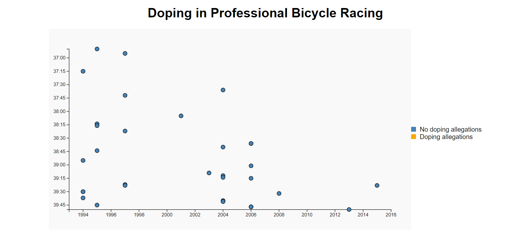

# Visualize-data-with-a-scatterplot-graph                                                                                                                                             

## Project Description

This project is a scatterplot graph that visualizes the Doping in Professional Bicycle Racing The application is built using HTML, CSS, and JavaScript, using the D3.js library for creating the graph and visualizing the data.

